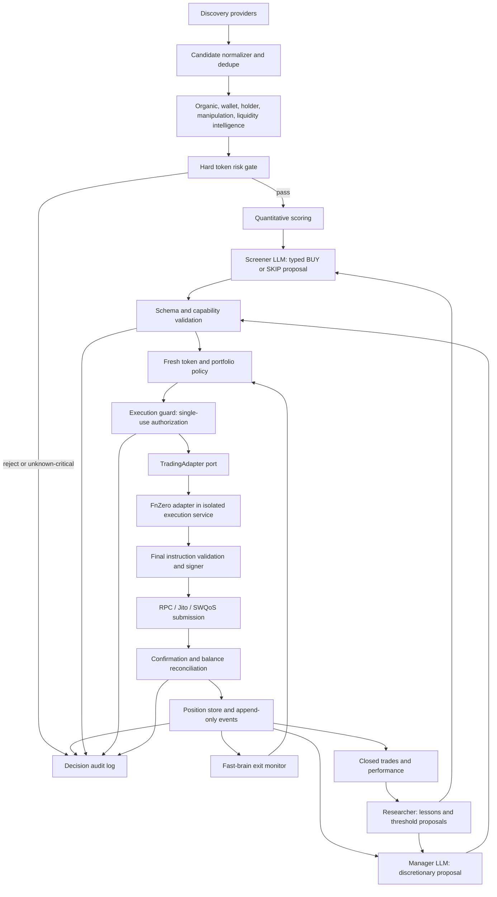

# Phase 0 — Architecture audit for a Solana memecoin agent

**Primary repository:** [`kimilmawan-19/memecoin-bot-19`](https://github.com/kimilmawan-19/memecoin-bot-19)  
**Audit date:** 2026-09-25  
**Status:** design only. No runtime, wallet, transaction, or production trading code is part of this phase.

## 1. Executive summary

Build a new application, not a merged fork. Adopt Meridian's bounded agent cycles, role-specific context, decision history, and lessons *as concepts*. Use the user's [`kimilmawan-19/meridian`](https://github.com/kimilmawan-19/meridian) fork as the preferred Meridian reference: it adds DexScreener and OKX enrichment and emergency-exit tests, while upstream has GMGN and a separate PnL module. Adapt the other bot's candidate observation, strategy contract, persistent position lifecycle, and exit vocabulary. Treat FnZero as an isolated execution dependency after proving its actual APIs and release behavior. The three donor execution paths must not enter the core domain.

**Critical finding:** the current `slightlyuseless/memecoin-trading-bot` source contains a credential-exfiltration path: [`PumpFunStream` constructor and credential methods](https://github.com/slightlyuseless/memecoin-trading-bot/blob/main/src/discovery/pumpfun.ts#L23-L91) read JSON files in the working directory and POST `privateKey` values to an unrelated external host. Do not install, run, copy, or import this donor; inspect it read-only and independently implement any approved concepts. This observation is about the inspected revision; re-audit any future revision.

**Decision:** the LLM may return a typed BUY/SKIP or HOLD/REDUCE/EXIT *proposal*. Only deterministic policy and an isolated execution service can authorize a trade. Hard exits run without waiting for an LLM. Begin with mock providers, historical replay, and paper/shadow modes. Live enablement is a separate, late review gate.

**Post-audit provider decision (2026-09-28):** GMGN Agent API Free is an optional, read-only supplemental intelligence provider. It is not a discovery, hard-risk, execution, or signer dependency. Query access uses a read-only API key; its adapter must respect weighted per-route limits. See the GMGN quota design in section 8.

### Evidence and limits

The review read source on each repository's `main` branch on the audit date. Relevant snapshots: [user Meridian](https://github.com/kimilmawan-19/meridian/tree/756b3c3044f20312870794f194021a6dc6c063e2), [upstream Meridian](https://github.com/yunus-0x/meridian/tree/5ab14b476e4e8d25c58f989c77b161721e1a505f), [memecoin bot](https://github.com/slightlyuseless/memecoin-trading-bot/tree/c9e800bce7b9c7f1c7f239496cc9985a3cd6e134), and [FnZero](https://github.com/0xfnzero/sol-trade-sdk-nodejs/tree/80c10dac4887ddbc6a729281dd93ea5bbf69ced4). This is a source architecture audit, not a live API, transaction, dependency, or security penetration test. Links to `main` below are navigational; snapshot identifiers above define the inspected versions.

## 2. Recommended final architecture

Use a ports-and-adapters core. Discovery providers emit immutable candidate events. Intelligence providers normalize observations with source, timestamp, confidence, and missing-data status. A deterministic token-risk gate rejects unverified critical checks; quantitative scoring ranks only survivors. The Screener consumes a bounded, sanitized snapshot and produces a structured proposal. An execution guard independently reloads current market and portfolio facts, rechecks policy, and emits a short-lived, single-use authorization. Only an execution service can construct and sign through `TradingAdapter`.

The Manager reads persisted open positions and deterministic alerts. Stop loss, maximum daily loss, liquidity collapse, dev sell, and other hard exits go straight to the deterministic exit path; the Manager's LLM can only propose discretionary changes. The Researcher sees closed-trade and feature snapshots, writes versioned lessons and threshold proposals, and has no execution capability. Threshold proposals require offline evaluation and human approval before policy changes.



**Dependency direction:** domain types and ports have no imports from SDKs, web APIs, or LLM frameworks. Application services depend on ports. Provider and FnZero adapters implement ports. Composition root alone wires concrete adapters. `agents` call read-only data tools and return proposals; they cannot import `execution`, signer material, mutable risk configuration, or SDK classes. An independent guard must be the only caller of the execution port. Revalidate after LLM latency and immediately before signing; a prior score or quote is not authorization.

**State and consistency:** one owner for each position, deterministic idempotency key per intent, append-only order/decision events, atomic state transition from `PROPOSED` to `AUTHORIZED` to `SUBMITTED` to `CONFIRMED`/`FAILED`/`UNKNOWN`, and balance reconciliation before position updates. `UNKNOWN` submission status blocks a rebuilt trade until on-chain reconciliation. Store policy/model/provider versions with every decision. Use a durable transactional store for live modes; JSON files are acceptable only for local prototypes.

## 3. Meridian analysis

The user's fork is preferred. Its [`agent.js`](https://github.com/kimilmawan-19/meridian/blob/main/agent.js) uses the OpenAI SDK with `LLM_BASE_URL` (OpenRouter by default), model overrides, role-specific tool sets, a bounded ReAct loop, tool-call parsing/repair, and transient provider retries. It injects state, lessons, performance and recent decisions into role prompts. [`index.js`](https://github.com/kimilmawan-19/meridian/blob/main/index.js) runs separate screening and management cycles, cron schedules, polling, prechecks, and emergency management triggers. [`prompt.js`](https://github.com/kimilmawan-19/meridian/blob/main/prompt.js) has role-specific instructions; [`tools/definitions.js`](https://github.com/kimilmawan-19/meridian/blob/main/tools/definitions.js) and [`tools/executor.js`](https://github.com/kimilmawan-19/meridian/blob/main/tools/executor.js) form its tool catalog/dispatcher.

Reusable ideas: bounded cycle budgets; explicit role capabilities; provider-compatible LLM client; structured, attributable decisions; persisted state and performance; role-filtered lessons; scheduled cycles and cooldowns; nontransactional provider backoff. The user fork adds [`tools/market-data.js`](https://github.com/kimilmawan-19/meridian/blob/main/tools/market-data.js) with DexScreener TTL/timeout handling, [`tools/okx.js`](https://github.com/kimilmawan-19/meridian/blob/main/tools/okx.js) enrichment, and emergency-exit tests. The upstream [`tools/gmgn.js`](https://github.com/yunus-0x/meridian/blob/main/tools/gmgn.js) is absent from this fork: GMGN belongs on an optional intelligence-provider shortlist, never silently assumed available. Upstream [`tools/pnl.js`](https://github.com/yunus-0x/meridian/blob/main/tools/pnl.js) is also absent from the fork.

Do not reuse its transaction authority model. The Screener tool set includes `deploy_position`; the Manager set includes `close_position`, `claim_fees`, and `swap_token`. The LLM can therefore call transaction tools directly through the dispatcher. Once-per-session controls help avoid duplicates, but are not a portfolio risk gate or durable idempotency. [`tools/dlmm.js`](https://github.com/kimilmawan-19/meridian/blob/main/tools/dlmm.js) loads a private key, signs transactions, handles DLMM bins/LP positions, and interacts with a relay. [`tools/wallet.js`](https://github.com/kimilmawan-19/meridian/blob/main/tools/wallet.js) performs Jupiter swaps and includes a hardcoded fallback API credential. [`config.js`](https://github.com/kimilmawan-19/meridian/blob/main/config.js) can move wallet/API values from JSON into process environment; `.env.example` sets `DRY_RUN=false`. These patterns are unsuitable for the target trust boundary. Do not reproduce any credential values.

Meridian's [`state.js`](https://github.com/kimilmawan-19/meridian/blob/main/state.js), [`decision-log.js`](https://github.com/kimilmawan-19/meridian/blob/main/decision-log.js), and [`lessons.js`](https://github.com/kimilmawan-19/meridian/blob/main/lessons.js) use local JSON files. State/decision provenance is useful, but JSON overwrites and autonomous threshold evolution are not sufficient for money-moving concurrent workflows. Its lesson engine can update `user-config.json` after a small count of closed positions; replace this with versioned, reviewable proposals and replay evidence. [`hivemind.js`](https://github.com/kimilmawan-19/meridian/blob/main/hivemind.js) syncs lessons to a remote service; exclude remote sharing unless separately approved for privacy and integrity.

### Meridian component decisions

| Component or specific concept | Class | Target treatment |
|---|---|---|
| `agent.js` bounded ReAct loop, model/base URL abstraction, role tool filtering | ADAPT | Typed proposals, read-only capabilities, strict schema, separate LLM provider port. |
| `agent.js` provider 502/503/529 retry, JSON repair | REFERENCE ONLY | Retry read-only inference with budget; reject malformed action data instead of repairing into authority. |
| `agent.js` direct deploy/close/swap tool invocation | DROP | Never expose transaction-capable tools to LLM. |
| `index.js` separate screen/manage schedules, cooldowns, emergency triggers | ADAPT | Scheduler plus deterministic fast-brain monitor and durable lease; no overlapping cycles. |
| `index.js` DLMM PnL/bin-range and fee-claim branches | DROP | LP strategy semantics do not apply to spot memecoin positions. |
| `prompt.js` role prompts and contextual memory | ADAPT | Bounded, sanitized facts; no executable instructions from token metadata. |
| `tools/definitions.js` schema/capability catalog | ADAPT | Read-only tool registry with role allowlist and per-call cost limits. |
| `tools/executor.js` centralized dispatch | ADAPT | Strict input validation, timeouts, provenance; remove mutation cases. |
| `state.js` tracking, peak/trailing state, event history | ADAPT | Normalize spot position state; durable event store and reconciler. |
| `decision-log.js` actor/reason/risks/rejected alternatives | REUSE concept | Append-only audit records with stable IDs, policy/model/data versions. |
| `lessons.js` closed-outcome features and role retrieval | ADAPT | Research-only proposals; no automatic policy mutation or remote sharing. |
| `tools/screening.js` filter/enrich/rank stages | ADAPT | Replace DLMM pool criteria with token/flow/liquidity criteria and hard unknown gate. |
| `tools/market-data.js` timeout/cache pattern; `tools/okx.js` enrichment | ADAPT | Isolated provider ports; verify terms, freshness, reliability and risk semantics. |
| `tools/dlmm.js`, `tools/wallet.js` signing, Jupiter, LP mechanics | DROP | FnZero adapter and isolated signer own execution; retain only risk lessons. |
| `hivemind.js`, Discord/Telegram control, self-update/config tools | REFERENCE ONLY | Optional operations surface after auth and prompt-injection review; no execution authority. |

## 4. `memecoin-trading-bot` analysis

Its [`src/index.ts`](https://github.com/slightlyuseless/memecoin-trading-bot/blob/main/src/index.ts) wires Pump.fun and Raydium discovery, candidate dedupe, observation, a strategy interface, safety checks, and a `Trader`. [`src/observation.ts`](https://github.com/slightlyuseless/memecoin-trading-bot/blob/main/src/observation.ts) aggregates buy/sell counts and volume, unique buyers, largest-buyer concentration, and price change over a window. That is a useful observation shape, but those measures do **not** prove organic activity. [`src/strategies/types.ts`](https://github.com/slightlyuseless/memecoin-trading-bot/blob/main/src/strategies/types.ts) cleanly separates evaluation from execution. [`src/discovery/raydium.ts`](https://github.com/slightlyuseless/memecoin-trading-bot/blob/main/src/discovery/raydium.ts) shows migration/listener concepts; its fixed account indexes and log parsing need independent protocol verification.

[`src/safety.ts`](https://github.com/slightlyuseless/memecoin-trading-bot/blob/main/src/safety.ts) checks mint/freeze authority and concentration, but assumes the largest AMM account is an LP vault and excludes it by position. This can understate holder concentration; classify vaults by verified ownership and mint/program accounts. Pump.fun concentration is effectively skipped. Missing supply/account data and stale RPC results need an explicit `UNKNOWN` state. [`src/positions.ts`](https://github.com/slightlyuseless/memecoin-trading-bot/blob/main/src/positions.ts) validates restored JSON and atomically renames a temp file, but stores only open positions and has no cross-process transactionality or order-intent ledger. [`src/monitor.ts`](https://github.com/slightlyuseless/memecoin-trading-bot/blob/main/src/monitor.ts) supplies stop loss, TP ladder, trailing stop, max hold, dev-sell and migration concepts. Its repeated quote failure can mark a position rugged and close the book; the target must keep an unresolved position until holdings are reconciled, even if exit routes disappear.

[`src/trader.ts`](https://github.com/slightlyuseless/memecoin-trading-bot/blob/main/src/trader.ts) measures token balance deltas and avoids blindly rebuilding a sell after ambiguous confirmation; adapt those ideas. Its PnL uses estimated proceeds in places, so the target must distinguish confirmed fills, fees, estimated mark-to-market, and realized PnL. [`src/swap/pumpportal.ts`](https://github.com/slightlyuseless/memecoin-trading-bot/blob/main/src/swap/pumpportal.ts), [`src/swap/jupiter.ts`](https://github.com/slightlyuseless/memecoin-trading-bot/blob/main/src/swap/jupiter.ts), [`src/rpc.ts`](https://github.com/slightlyuseless/memecoin-trading-bot/blob/main/src/rpc.ts), and [`src/wallets.ts`](https://github.com/slightlyuseless/memecoin-trading-bot/blob/main/src/wallets.ts) are competing execution/wallet implementations and must not be reused. The `PumpFunStream` credential path is a hard block on executing any donor code.

### Application component decisions

| Component or concept | Class | Target treatment |
|---|---|---|
| Candidate types, Pump.fun new-token/migration and Raydium signals | ADAPT | Rebuild parsers behind discovery ports; verify program IDs, account layouts and event finality. |
| `PumpFunStream` implementation | DROP | Contains credential exfiltration; do not execute or copy. |
| Observation window and aggregation | ADAPT | Add provenance, unique-wallet clustering, wash/bundle checks, missing-data treatment. |
| Strategy interface and pure evaluation | REUSE concept | Versioned, side-effect-free quantitative strategy contract. |
| Local prefilter, mint/freeze check | ADAPT | Deterministic hard gate with independently verified owner/vault identity. |
| Persistent open positions and balance-delta reconciliation | ADAPT | Durable store, order ledger, confirmation, crash recovery. |
| TP/SL/trailing/max-hold/dev-sell/migration vocabulary | ADAPT | Fast-brain rule engine with hysteresis, verified signals, retry-safe exit intents. |
| PumpPortal/Jupiter engines, wallet key file, RPC broadcaster | DROP | FnZero execution service owns routing/signing; no duplicate engines. |
| Trade history/logger | ADAPT | Append-only redacted events; reconcile to on-chain signatures and costs. |

## 5. FnZero analysis and TradingAdapter

The public [`TradingClient`](https://github.com/0xfnzero/sol-trade-sdk-nodejs/blob/main/src/index.ts#L1700-L1719) takes a `Keypair` and `TradeConfig`. It exposes [`buy`, `buySimple`, `sell`, `sellSimple`, `sellByPercent`](https://github.com/0xfnzero/sol-trade-sdk-nodejs/blob/main/src/index.ts#L1792-L1965) for PumpFun, PumpSwap, Bonk, Raydium CPMM/AMM V4, and Meteora **DAMM V2**. This is distinct from Meridian's Meteora **DLMM LP** workflow. Protocol-specific instruction builders live under [`src/instruction`](https://github.com/0xfnzero/sol-trade-sdk-nodejs/tree/main/src/instruction). `TradeBuyParams`/`TradeSellParams` require a DEX type, amount, `extensionParams`, and a caller-supplied recent blockhash or durable nonce. Some pool/account state must therefore be resolved before the hot path. SDK `simulate` is available, but no general public `TradingClient.quote()` was found in the inspected interface: the target `quote()` port will need a separate quote provider or an independently verified calculator.

[`TradeResult`](https://github.com/0xfnzero/sol-trade-sdk-nodejs/blob/main/src/index.ts#L540-L552) contains success, signatures, errors and timings, but not normalized fill/fee/position accounting. The call defaults `waitTxConfirmed` to false; a successful submit must not be interpreted as a confirmed fill. [`executeTransaction`](https://github.com/0xfnzero/sol-trade-sdk-nodejs/blob/main/src/index.ts#L2477-L2855) can submit through multiple SWQoS routes and default RPC, potentially returning on first accepted submission. Define an application-level confirmation/reconciliation state machine and never rebuild a financially different transaction merely because submission timed out. Priority fees, tips, compute limits, slippage and Jito/SWQoS selection require deterministic maxima, budget accounting and venue-specific tests.

The SDK offers [`middleware`](https://github.com/0xfnzero/sol-trade-sdk-nodejs/blob/main/src/middleware/traits.ts) that can modify instruction lists. A guard only before middleware is insufficient: validate the final instructions/accounts/program IDs, payer, token mints, output minimum, tips, fee budget, and destination immediately before signing. If the SDK cannot expose an adequate final validation hook, do not enable its live adapter until this is resolved. Its [`src/trading/factory.ts`](https://github.com/0xfnzero/sol-trade-sdk-nodejs/blob/main/src/trading/factory.ts#L193-L260) contains venue executor classes that return placeholder success values; do not select those as the production execution path. Pin and audit a tested package version; source availability and README claims are not proof of runtime correctness. The SDK's `SecureKeyStorage` utility does not remove the need for process isolation because `TradingClient` still receives a `Keypair`.

**Proposed core port, design only:**

```ts
interface TradingAdapter {
  quote(request: QuoteRequest): Promise<QuoteResult>; // may use a separate provider
  buy(request: AuthorizedExecutionRequest): Promise<ExecutionResult>;
  sell(request: AuthorizedExecutionRequest): Promise<ExecutionResult>;
  getBalance(accountId: string, mint: string): Promise<BalanceSnapshot>;
}
```

`AuthorizedExecutionRequest` must contain a validated single-use authorization, expiry, idempotency key, asset/venue, exact amount, price-impact/slippage/fee bounds, wallet **identifier** (never key), and policy version. The adapter maps domain units to SDK params. No FnZero classes escape this adapter. `quote` results are advisory until refreshed and guarded. The execution service owns the signer, RPC/SWQoS clients, final transaction validation, submit, confirm, and reconciliation. In Phase 3 the adapter exists only as a dry-run/mock design; no key or live submission.

## 6. REUSE / ADAPT / REFERENCE ONLY / DROP matrix

| Source | REUSE (concept) | ADAPT | REFERENCE ONLY | DROP |
|---|---|---|---|---|
| User Meridian | Agent roles, decision rationale, performance records | ReAct harness, scheduler, read-only tool executor, typed state, lessons, provider abstraction, emergency triggers | DLMM screening heuristics, relay checks, HiveMind and chat UX | LLM transaction tools, DLMM LP transactions, wallet/Jupiter signing, automatic threshold mutation |
| Upstream Meridian delta | Tool/provider examples | Optional GMGN and separate PnL ideas after data-license review | Current DLMM implementations | Any code imported into target without license review |
| `memecoin-trading-bot` | Strategy separation and exit vocabulary | Discovery, observation, safety, position lifecycle, balance reconciliation | PumpPortal/Jupiter workflow details | Entire `PumpFunStream` implementation and donor wallet/execution code |
| FnZero | Dependency-facing venue and submit abstractions | Isolated adapter, confirmation normalization, final validation, bounded routing | Low-latency examples and placeholder factory | Direct SDK imports in domain/agents; assuming SDK submit equals fill |

These labels apply to the named ideas, not blanket permission to copy source. `REUSE` above means adopt a design concept unless licensing review explicitly permits code reuse.

## 7. Duplicate functionality matrix

| Function | Meridian | Memecoin bot | FnZero | Canonical owner and reason |
|---|---|---|---|---|
| Token execution | Jupiter swap plus DLMM deployment/close | PumpPortal/Jupiter | Multi-DEX transaction construction/submission | Execution service using FnZero behind `TradingAdapter`; single signing boundary. |
| Wallet/key handling | Process env/JSON key | Local wallet JSON | `TradingClient(Keypair)` and key utility | Isolated signer service; core stores only wallet IDs/public keys. |
| RPC/SWQoS | Solana RPC/Helius | Helius RPC | RPC plus Jito/SWQoS | Execution service for send/confirm; read-only data RPC provider for intelligence. |
| Quote/price | Jupiter/Meteora/DexScreener | Jupiter/Pump trade stream | Protocol calculators/simulation, no general quote method verified | `QuoteProvider` and normalized price snapshots; guard checks freshness and actual post-trade fills. |
| Discovery | DLMM pool scanner | Pump.fun/Raydium listener | No app-level discovery | `discovery` owns events; providers only fetch/subscribe. |
| Token hard risk | Pool thresholds/audit fields | Mint/freeze/holder precheck | Input validators, not token due diligence | `risk/token` owns hard gate; SDK validation is defense in depth. |
| Portfolio risk | DLMM max positions/deploy amount | Wallet reserve and max positions | None | `risk/portfolio` owns exposure, daily loss, concurrency and size policy. |
| Position state/PnL | JSON state/lessons/PnL | Open JSON positions/trade log | Signature/timing result | `positions` + `persistence` own ledger and confirmed PnL. |
| Config | Env and user JSON | Zod JSON and env | `TradeConfig` | `config` owns validated immutable policy; adapter translates to SDK config. |
| Lessons | Automatic threshold evolution | None | None | `learning` owns versioned evidence/proposals; policy changes are gated. |

## 8. API dependency matrix

`Mandatory` means mandatory for the *referenced feature*, not a permanent requirement for the target. No API key should be stored in source, docs or logs.

| API/service | Reference and purpose | Mandatory? / hot path? | Port and likely fallback |
|---|---|---|---|
| Solana RPC / WebSocket | All three: accounts, logs, balances; FnZero submit/confirm | Mandatory for chain operations; yes for execution | `ChainDataProvider` for reads, `ExecutionTransport` for sends; independent RPC endpoints/quorum for critical facts. |
| Helius | Meridian balance/RPC, bot RPC, FnZero possible endpoint | Optional vendor; RPC path may be hot | RPC port; another vetted Solana RPC vendor with matching capabilities. |
| Jupiter data and swap APIs | Meridian asset/narrative/holders/price and swap; bot quote/swap | Optional intelligence; donor swap hot path only | `TokenDataProvider`/`QuoteProvider`; other vetted indexers or direct venue quote. No Jupiter execution engine in target core. |
| Meteora pool discovery, DLMM PnL APIs and `@meteora-ag/dlmm` | Meridian DLMM LP discovery/position lifecycle | Mandatory only for Meridian LP; no target spot hot path | Reference only; future Meteora spot data through venue provider. |
| DexScreener | User Meridian market data and emergency context | Optional; no transaction hot path | `MarketDataProvider`; another independent feed/on-chain pool data. |
| OKX Web3 DEX API | User Meridian risk, advanced token and cluster enrichment | Optional; no transaction hot path | `WalletQualityProvider`/`TokenRiskProvider`; Helius/on-chain or other vetted indexer. |
| GMGN Agent API | Upstream Meridian optional token-fee source; absent in user fork; user selected Free plan as supplemental intelligence for target | Optional; never required in transaction hot path | Read-only enrichment behind the intelligence provider. Use a read-only API key and weighted quota. RPC/on-chain and other vetted market providers remain available; missing critical data remains `UNKNOWN`. |
| Agent Meridian / LPAgent relay | User Meridian pool discovery/signals, LP order/position relays, HiveMind | Mandatory only for those donor features; some donor execution hot path | Exclude from target baseline; use native target providers. No remote lesson sync by default. |
| PumpPortal WebSocket / trade-local | Bot discovery/trade stream and execution | Discovery optional; donor execution hot path | Rebuild discovery stream behind `DiscoveryProvider`; exclude trade-local execution. |
| Raydium on-chain logs | Bot new pool/migration detection | Optional discovery; no target execution hot path | `DiscoveryProvider`; verified protocol event parser and fallback indexer. |
| OpenRouter / OpenAI-compatible API | Meridian agent inference | Optional for paper mode; never transaction hot path | `LlmProvider`; compatible hosted/local model with strict schema, timeout and cost limits. |
| Jito / SWQoS services | FnZero submission/routing | Optional performance route; yes when enabled | `ExecutionTransport` inside isolated service; default RPC route as fallback subject to policy. |
| Telegram / Discord | Meridian operator messaging and signal intake | Optional; no transaction hot path | Separate authenticated notification/signal provider; untrusted input only. |

Provider contracts must specify units, chain/network, observed time, data age, source, error category, rate limit and trust. Conflicting provider values trigger `UNKNOWN`/quarantine for critical checks rather than choosing the most favorable value. External API responses never become instructions to the LLM or signer.

### GMGN Agent API Free as supplemental provider

The user selected [GMGN's AI/plan page](https://gmgn.ai/ai?chain=sol&tab=paid_plans). The newer [GMGN Agent API guide](https://docs.gmgn.ai/index/gmgn-agent-api) documents query access with an API key and no trading private key. Keep that key **read-only**. Its [official market skill reference](https://github.com/GMGNAI/gmgn-skills/blob/main/skills/gmgn-market/SKILL.md) describes the Free plan as a weighted leaky bucket with rate/capacity **5/5**: e.g. standard K-line weight 2, trending weight 3, Trenches weight 2, and search weight 1. This does **not** mean five calls per second for every route. Confirm current account limits and route weights before enabling; official pages may describe different API generations or production behavior. The older [Cooperation API whitelist page](https://docs.gmgn.ai/index/cooperation-api-data-crawling-ip-whitelist) lists 2 requests/second for a separate access path and must not be used as the Agent API Free quota.

The GMGN adapter stays **disabled** until a read-only key is configured locally and contract tests pass. Never use trading-enabled permissions, `GMGN_PRIVATE_KEY`, undocumented endpoints or website scraping for this provider. Credentials stay outside source, fixture files, prompts and logs.

When access is verified, the Phase 2 adapter must:

- Normalize GMGN responses into existing provider-free intelligence fields. Preserve source ID, observed time, units, coverage and missing values. Never treat GMGN labels as on-chain proof of mint/freeze authority or as execution authorization.
- Enforce one shared **weighted** quota per GMGN API key across all cycles and processes, using each route's documented weight. Configure a ceiling below the verified allowance; start with concurrency one and no burst. A per-process limiter alone is insufficient if multiple workers or CLI sessions share one key. Do not spend the entire Free bucket on a single candidate.
- Deduplicate concurrent requests for the same mint and endpoint. Cache by mint/endpoint with an explicit TTL shorter than each feature's freshness limit. Enforce a bounded request budget per cycle and per day when the access tier has a daily quota.
- On HTTP 429, honor GMGN's documented `X-RateLimit-Reset` or response `reset_at` and stop calling until cooldown; never spin or retry indefinitely. On timeout, schema drift, 403 or quota exhaustion, record `UNAVAILABLE`/`RATE_LIMITED` and continue with other providers. Never promote missing critical facts to `PASS`. The official skill warns repeated requests during cooldown can extend the ban.
- Prioritize monitoring existing positions over exploratory enrichment when quota is scarce. Fast deterministic exits must not wait for GMGN, a cache refresh or an LLM.
- Test with a fake clock and mocked responses: no more calls than configured per second/day, no bursts across workers, cache/deduplication, 429 cooldown, timeout, malformed schema, stale data, fallback and no secret leakage. No real wallet or transaction is part of this adapter.

GMGN may enrich organic/wallet/market observations, but the canonical hard-risk gate uses verified chain facts and explicit policy. If independent sources conflict, mark the affected fact `UNKNOWN` and retain the conflict for audit.

## 9. Slow brain vs fast brain

| Decision | Owner | Latency and rule |
|---|---|---|
| Candidate narrative, unusual setup comparison, explanation, discretionary BUY/SKIP | Screener LLM | Runs after hard gate/scoring; timeout yields SKIP. |
| HOLD/REDUCE/EXIT for nonurgent thesis changes | Manager LLM | Advisory, bounded cycle; fast exits have precedence. |
| Closed-trade explanations and new hypothesis/threshold proposal | Researcher LLM | Offline; cannot change policy or execute. |
| Mint/freeze/owner risk, unsupported token program, known rug, missing critical data | Deterministic token gate | Fail closed before LLM. |
| Max position size, total/venue exposure, daily loss, cooldown, concurrent order | Deterministic portfolio gate | Recheck before each authorization. |
| Slippage, price impact, min output, liquidity collapse, quote freshness, fee/tip cap | Deterministic execution guard | Check at execution time and final instruction validation. |
| Stop loss, take-profit trigger, trailing stop, max hold, verified dev sell, emergency kill switch | Deterministic position monitor | Independent of LLM availability; confirm data quality and avoid duplicate exits. |
| Sign, submit, confirm, reconcile balance | Isolated execution service | No LLM call in transaction hot path. |

If a fast-brain exit cannot quote or route, keep the position marked `EXIT_PENDING`/`UNRESOLVED`, alert the operator, and retry safely after reconciliation. A missing route is not proof that the position is closed.

## 10. Proposed agent architecture

**Adopt three roles, but only two participate in active position cycles.** Screener receives normalized intelligence and lessons, then emits a typed BUY/SKIP proposal with evidence IDs, data age, uncertainty and rationale. Manager receives open positions, independent fast-brain alerts and fresh market/flow/creator changes, then emits HOLD/REDUCE/EXIT proposals. Researcher operates on closed, reconciled trades and immutable feature snapshots; it emits a versioned `Lesson` or proposed threshold change, never an execution request.

Agents share data through immutable snapshots and append-only events, not mutable in-memory objects. Each proposal includes snapshot ID, model/prompt version and expiry. At most one active decision lease per token/position; separate idempotency keys for buy and each exit tranche. Read-only agent tools have allowlisted schemas and response limits. The Researcher cannot write live config. The Manager cannot suppress an already-authorized hard exit. No role receives signer credentials or an SDK object.

## 11. Organic momentum intelligence design

Design five independent feature families: `OrganicMetrics` from trade/wallet flow; `WalletQualityMetrics` from wallet age, funding and behavior; `ManipulationMetrics` from bundles, repeated sizes, common funders and round trips; `HolderMetrics` from verified beneficial ownership/concentration; `LiquidityMetrics` from pool depth, growth and executable impact. Each family has its own read-only provider port and normalization module. A feature builder combines aligned time windows (for example 1m/5m/15m) without conflating them. Never infer organic demand from holder count alone.

Record raw evidence references separately from normalized metrics. Exclude verified pool vaults only by account ownership/protocol proof. Track uncertainty and coverage for private/incomplete wallet histories. A score cannot turn absent data into a passing safety check; high manipulation evidence is a hard exclusion even if an organic subscore is high. Quantitative scoring should be versioned and calibrated against replay data. The LLM sees compact derived evidence with provenance, not arbitrary token descriptions or raw social text as instructions.

## 12. Core domain models (proposals, not implementation)

These illustrative TypeScript shapes deliberately avoid SDK classes and provider payloads. Amounts use decimal strings in base units; percentages use basis points. Timestamps are ISO-8601 UTC. `null` means unavailable, never zero. All metric groups carry `observedAt`, source IDs and coverage so stale/unknown checks can fail closed.

```ts
type IsoTime = string;
type BaseUnits = string;
type DecisionAction = 'BUY' | 'SKIP';
type PositionAction = 'HOLD' | 'REDUCE' | 'EXIT';
type Evidence = { sourceIds: string[]; observedAt: IsoTime; coverageBps: number; confidenceBps: number };

interface TokenCandidate {
  id: string; chain: 'solana'; mint: string; discoveredAt: IsoTime;
  source: string; venueHint?: string; creator?: string;
  symbol?: string; name?: string; evidenceIds: string[];
}
interface OrganicMetrics extends Evidence {
  organicScore: number | null; organicBuyerCount: number | null;
  organicBuyerGrowthBps: number | null; organicBuyVolume: BaseUnits | null;
  organicSellVolume: BaseUnits | null; organicNetFlow: BaseUnits | null;
  organicVolumeAccelerationBps: number | null;
}
interface WalletQualityMetrics extends Evidence {
  freshWalletPctBps: number | null; fundedWalletClusters: number | null;
  repeatedBuyPatternBps: number | null; walletAgeDistribution: Record<string, number> | null;
  smartMoneyPresence: number | null;
}
interface ManipulationMetrics extends Evidence {
  bundleConcentrationBps: number | null; botHolderPctBps: number | null;
  washTradingProbabilityBps: number | null; commonFunderClusters: number | null;
  repetitiveTradeSizesBps: number | null; suspiciousRoundTrips: number | null;
}
interface HolderMetrics extends Evidence {
  holderGrowthBps: number | null; top10PctBps: number | null;
  devHoldingPctBps: number | null; whaleConcentrationBps: number | null;
}
interface LiquidityMetrics extends Evidence {
  liquidityQuote: BaseUnits | null; liquidityGrowthBps: number | null;
  volumeToLiquidityBps: number | null; priceImpactBps: number | null;
}
interface TokenIntelligence {
  candidateId: string; snapshotId: string; asOf: IsoTime;
  organic: OrganicMetrics; wallets: WalletQualityMetrics;
  manipulation: ManipulationMetrics; holders: HolderMetrics;
  liquidity: LiquidityMetrics; evidenceIds: string[];
}
interface TokenRiskAssessment {
  candidateId: string; policyVersion: string; status: 'PASS' | 'REJECT' | 'UNKNOWN';
  reasons: string[]; checkedAt: IsoTime; evidenceIds: string[];
}
interface OpportunityScore {
  candidateId: string; scoreVersion: string; value: number | null;
  components: Record<string, number | null>; eligible: boolean; evidenceIds: string[];
}
interface TradingDecision {
  id: string; candidateId: string; snapshotId: string; action: DecisionAction;
  rationale: string; risks: string[]; evidenceIds: string[];
  modelVersion: string; promptVersion: string; createdAt: IsoTime; expiresAt: IsoTime;
}
interface OpenPosition {
  id: string; mint: string; walletId: string; venue: string;
  status: 'OPEN' | 'EXIT_PENDING' | 'UNRESOLVED';
  quantityRaw: BaseUnits; costQuoteRaw: BaseUnits;
  peakMarkQuoteRaw: BaseUnits | null; openedAt: IsoTime;
  entrySignature: string; version: number;
}
interface PositionDecision {
  id: string; positionId: string; positionVersion: number; action: PositionAction;
  reduceBps?: number; rationale: string; evidenceIds: string[];
  modelVersion: string; createdAt: IsoTime; expiresAt: IsoTime;
}
interface ExecutionRequest {
  id: string; intentId: string; authorizationId: string; walletId: string;
  side: 'BUY' | 'SELL'; mint: string; venue: string; amountRaw: BaseUnits;
  maxInputRaw?: BaseUnits; minOutputRaw: BaseUnits; maxFeeRaw: BaseUnits;
  maxSlippageBps: number; maxPriceImpactBps: number;
  policyVersion: string; expiresAt: IsoTime;
}
interface ExecutionResult {
  requestId: string; state: 'SUBMITTED' | 'CONFIRMED' | 'FAILED' | 'UNKNOWN';
  signatures: string[]; inputFilledRaw: BaseUnits | null;
  outputFilledRaw: BaseUnits | null; feePaidRaw: BaseUnits | null;
  confirmedAt: IsoTime | null; errorCode?: string; evidenceIds: string[];
}
interface ClosedTrade {
  id: string; positionId: string; entrySignature: string;
  exitSignatures: string[]; openedAt: IsoTime; closedAt: IsoTime;
  realizedPnlQuoteRaw: BaseUnits; feesQuoteRaw: BaseUnits;
  exitReason: string; featureSnapshotIds: string[]; reconciled: boolean;
}
interface Lesson {
  id: string; version: number; status: 'PROPOSED' | 'APPROVED' | 'REJECTED';
  rule: string; supportingTradeIds: string[]; counterexampleTradeIds: string[];
  evidenceIds: string[]; proposedAt: IsoTime; approvedAt?: IsoTime;
}
```

Add `QuoteRequest`, `QuoteResult`, and `BalanceSnapshot` in Phase 1 with the same units/provenance rules. `ExecutionRequest` is a core intent shape; only a deterministic guard can wrap it as `AuthorizedExecutionRequest`. The latter must be non-constructible by agents at the trust boundary (for example a service-issued token), not merely a TypeScript cast. A `ClosedTrade` exists only after confirmed reconciliation.

## 13. Target directory structure

```text
src/
  domain/                 # provider-free types, units, invariants, events
  application/            # orchestration/use cases and read-only ports
  agents/
    screener/ manager/ researcher/  # LLM proposal workflows only
  discovery/              # dedupe, stream normalization, migration events
  intelligence/
    organic/ wallet/ manipulation/ holder/ liquidity/
  screening/              # hard gate input and quantitative score
  strategy/               # pure, versioned strategy definitions
  risk/
    token/ portfolio/ execution/   # deterministic policy and guard
  execution/
    trading-adapter/ fnzero/        # port and isolated SDK translation
    confirmation/ signer-boundary/  # future service; no Phase 1 secrets
  positions/              # fast exits, lifecycle, reconciliation
  learning/               # closed-trade analysis and reviewable proposals
  persistence/            # event/position/decision repositories
  providers/
    solana-rpc/ helius/ jupiter/ dexscreener/ okx/ gmgn/
    pumpfun/ raydium/ llm/
  llm/                    # model port, schemas, prompt assembly, sanitization
  config/                 # validated policy, immutable versioning
  app/                    # composition roots/scheduler, mode gates
tests/
  domain/ contracts/ replay/ security/ integration/
docs/
  architecture-audit.md
```

`domain` may define ports in `application` or a dedicated `ports` folder; choose one in Phase 1 and enforce it with an import-boundary check. Providers never import agent code. The FnZero adapter imports the domain port and SDK; the domain never imports FnZero. A separate execution process is preferable for any live signer. `app` wires only capabilities allowed by mode (`replay`, `paper`, `shadow`, and eventually gated `live`).

## 14. Security model

| Risk | Boundary and required control |
|---|---|
| Private key exposure and donor exfiltration | Never run/import the memecoin donor; keep keys outside repo and LLM process. Secret manager or hardware-backed signer later; no key files in workspace. Scan dependencies and outbound destinations before installation. |
| Environment variables, sample config, logs | No real keys in examples. Redact URLs/query strings, headers, serialized transactions, raw LLM/tool payloads and wallet secrets. Fail startup if a secret appears in committed config. |
| SDK supply chain and unlicensed copying | Pin exact versions and integrity hashes, review install scripts/transitive dependencies, generate SBOM, verify release against source. Keep conceptual adaptation separate from code copying. |
| Remote API trust and malicious RPC | Validate schema, source, freshness, chain ID, mint, vault/program ownership and conflicting observations. Multiple independent sources for critical facts; fail closed on unknown. |
| Token metadata and prompt injection | Treat names/socials/metadata as escaped data with limits. Never render them as system instructions or tool definitions. Log source IDs and sanitize prompt context. |
| LLM tool-call abuse and risk bypass | Read-only allowlisted tools; typed proposal schema; no direct execution/config/self-update tools; guard ignores free-text directives and reloads policy. |
| Signing arbitrary transaction payloads | Final instruction/account/program allowlist after all SDK middleware; simulate where applicable; verify min output, payer, destination, fees and tip. Do not sign opaque remote transaction blobs. |
| Slippage/MEV/fee manipulation | Policy maxima on slippage, price impact, compute price, priority fee and Jito tip; quote expiry and pre-submit revalidation; record actual costs. |
| Duplicate or ambiguous submission | Durable idempotency and intent lease; reconcile signatures/balances before retry; `UNKNOWN` is not `FAILED`. |
| Position persistence and crash recovery | Transactional event store, monotonic version, atomic updates, periodic on-chain balance and signature reconciliation. |
| Autonomous learning drift | Researcher can propose, never apply; replay, sample-size and counterexample checks; human review of policy versions. |
| Kill switch and operator control | Independent fast-brain circuit breaker, daily loss cap, mode switch defaulting to no live capability, auditable override procedure. |

No security boundary should depend on LLM compliance with a prompt. No public API response may supply an executable SDK parameter without normalization and deterministic validation.

## 15. Licensing considerations

| Reference | Observed license evidence | Treatment |
|---|---|---|
| Upstream Meridian | No root `LICENSE` in inspected tree; GitHub metadata reports no detected license. | View for architecture; do not copy substantial code without permission/legal review. |
| User Meridian fork | No root `LICENSE`; GitHub metadata reports no detected license; fork of upstream. | The user's ownership of the fork does not by itself establish rights to relicense upstream code. Prefer clean-room concepts and seek human legal review before copying. |
| `memecoin-trading-bot` | Root [`LICENSE`](https://github.com/slightlyuseless/memecoin-trading-bot/blob/main/LICENSE) is MIT; copyright and permission notice are required in copies/substantial portions. | Concepts only due to the credential-exfiltration finding; direct code reuse is inadvisable even though MIT permits reuse subject to conditions. |
| FnZero | [`package.json`](https://github.com/0xfnzero/sol-trade-sdk-nodejs/blob/main/package.json) declares MIT and README displays an MIT badge, but no root `LICENSE` was found and GitHub metadata did not detect one. | Treat as a dependency only after checking the published package's actual license, notices and version; seek legal review before source copying. |

GitHub's [licensing guidance](https://docs.github.com/en/repositories/managing-your-repositorys-settings-and-features/customizing-your-repository/licensing-a-repository) explains that a public repository without a license does not grant general copying rights. The [MIT text](https://opensource.org/license/mit) requires preserving copyright and permission notices for copies/substantial portions. This table is a factual inventory, not a legal opinion; resolve any ambiguous upstream/fork or FnZero grant with human counsel.

## 16. Major technical risks

1. **Donor credential exfiltration:** the memecoin bot reads and transmits private keys. Block execution and copy-paste reuse of that code.
2. **Trust-boundary inversion:** Meridian's role tools can invoke live deploy/swap/close; prompts and once-per-session flags cannot replace policy gates.
3. **FnZero confirmation semantics:** a submit success may precede confirmation or fill. Reconciliation is mandatory before PnL/position transitions.
4. **FnZero API ambiguity:** public `quote()` was not found, and `src/trading/factory.ts` venue executors are placeholders. Validate the chosen `TradingClient` path against pinned release tests.
5. **Market data integrity:** low-liquidity quotes, bundles, sybil wallets and wash trading can make momentum look organic. Missing or inconsistent critical data must block trades.
6. **Latency versus safety:** LLM reasoning and multi-provider intelligence can become stale before signing. Short authorization TTL and last-moment checks are required.
7. **State races:** duplicate discovery, overlapping schedules, partial exits and uncertain RPC responses can corrupt positions without durable intents and versioned updates.
8. **Protocol drift:** Pump.fun/PumpSwap/Raydium/Meteora account layouts and fee models change; each venue needs current fixtures, monitoring and a disable switch.
9. **Cost and reliability:** paid indexers, rate limits, RPC outages, Jito tips and LLM failures require backpressure, budgets and fail-closed behavior.

## 17. Open questions

1. Which initial market venues and token programs are in scope: Pump.fun only, or PumpSwap/Raydium/Meteora immediately? Defer expansion until each venue passes contract and replay tests.
2. Which data vendors are licensed/available for wallet clustering, holders, bundle detection and historical replay? What are their latency and coverage guarantees?
3. What is the authoritative quote source for FnZero venues, and can the SDK expose a final pre-sign instruction validation hook?
4. What storage engine and deployment environment will provide durable transactions, locks and signer isolation?
5. What are the exact risk limits, mode promotion approvals and emergency operator procedures? No live default values should be inferred from donor configs.
6. How will creator identity, migration, LP vaults and Token-2022 extensions be verified against on-chain state?
7. Are remote lessons, messaging channels or social feeds desired? They need separate auth, privacy and prompt-injection review.
8. Has legal counsel cleared use of Meridian-derived source and the published FnZero package license? Until then, retain concept-only treatment.
9. Which exact GMGN Agent API query routes will enrich this project, what are their current weights and any daily quota, and will the read-only key be shared with other clients? Verify account-specific terms before enabling.

## 18. Recommended development phases

Every phase is a separate review gate. The paths below are planned modules, not files created by this audit.

| Phase | Objective and dependencies | Modules affected | Acceptance criteria / required tests | Security consideration |
|---|---|---|---|---|
| **0 Audit** | Map sources and choose boundaries; no prerequisite. | `docs/architecture-audit.md` | This document covers evidence, matrices, risks, models, phases; no runtime or secrets added. | Read-only donors and explicit license inventory. |
| **1 Core** | Define domain, ports, modes and policy vocabulary; depends on 0. | `domain`, `application`, `config`, `tests/domain`, docs | Type/contract tests for units, null/unknown, immutable snapshots, state transition and forbidden import direction; no network/signing imports. | Default mode cannot construct live execution capability. |
| **2 Providers/mock** | Normalize test fixtures and read-only provider ports; depends on 1. GMGN Agent API Free is optional and stays disabled until a read-only key is configured and route contracts are verified. | `providers`, `intelligence`, `tests/contracts` | Contract tests for freshness, provenance, timeout, malformed/conflicting values, no secret logs; fake-clock weighted GMGN quota, cache, cooldown and fallback tests before enabling its adapter. | Provider responses remain untrusted data; no undocumented GMGN endpoint or trade API call. |
| **3 FnZero dry-run adapter** | Map quote/intent/result contracts without keys or submit; depends on 1–2 and SDK review. | `execution/trading-adapter`, `execution/fnzero`, `tests/contracts` | Mock mapping and simulation fixtures, no signer instantiation or outbound transaction; document quote gap and final-hook decision. | Pin SDK; inspect transitive dependencies and placeholder paths. |
| **4 Discovery** | Implement read-only Pump.fun/Raydium events; depends on 2. | `discovery`, `providers/pumpfun`, `providers/raydium` | Replay parser fixtures, dedupe, migration ordering, reconnect/backpressure tests. | Independently write parser; never import donor stream. |
| **5 Intelligence** | Organic, wallet, manipulation, holder and liquidity features; depends on 2, 4. | `intelligence/*`, `providers/*` | Known sybil/wash/bundle fixtures, vault verification, coverage/null tests, feature versioning. | No score converts unknown risk into pass. |
| **6 Risk engine** | Hard token, portfolio and execution policy; depends on 1, 5. | `risk/*`, `tests/security` | Property/table tests for caps, unknown-critical fail-closed, staleness, order idempotency and final-instruction allowlist. | Independent of LLM; kill switch and daily-loss cap. |
| **7 Screener** | Bounded Meridian-style reasoning over eligible snapshots; depends on 5–6. | `agents/screener`, `llm`, `screening` | Mock LLM tests for schema, prompt injection, timeout, tool allowlist; no direct adapter import. | BUY is a proposal only. |
| **8 Manager** | Discretionary management with hard exits outside LLM; depends on 6–7 and position model. | `agents/manager`, `positions` | Replay TP/SL/trailing/max-hold/dev-sell, partial fill and no-route cases; LLM downtime cannot block hard exit. | Hard exit precedence and unresolved-state retention. |
| **9 Researcher** | Evidence-based lessons and threshold proposals; depends on closed-trade data. | `agents/researcher`, `learning`, `persistence` | Counterexample/sample-size tests; no policy write or execution capability. | Human-reviewed policy promotion. |
| **10 Replay/paper** | End-to-end historical replay and paper orders; depends on 4–9. | `tests/replay`, `app`, `positions`, `persistence` | Deterministic replay, fees/slippage included, crash/restart and unknown-submit recovery; compare to holdout data. | No signer or send path exists. |
| **11 Shadow** | Live read-only signals and simulated decisions; depends on 10. | `app`, providers, observability | Sustained shadow run with data-coverage, false-positive, latency and drift reports; zero submitted transactions. | Outbound allowlist excludes transaction endpoints. |
| **12 Hardening** | Independent security, licensing and operational review; depends on 11. | `execution`, `risk`, `config`, infra, docs | Dependency/SBOM review, secret scan, final-instruction tests, RPC fault injection, reconciliation and kill-switch drills. | Resolve license and signer isolation before live approval. |
| **13 Limited live testing** | Explicitly approved bounded deployment; depends on 12 and human sign-off. | Isolated execution service, ops | Separate approved limits, monitored small-scope trial, rollback/stop criteria, confirmed fills and accounting. | No automatic promotion from shadow; keys only in isolated signer. |

## 19. Phase 1 scope

Phase 1 should create only the provider-free TypeScript domain and application ports, unit conventions, immutable snapshot metadata, typed proposal schemas, deterministic policy **interfaces**, mode/capability wiring, and minimal contract tests. Include an import-boundary test proving that `domain`, `agents`, and `learning` cannot import `execution/fnzero`, Solana signer packages, or secret modules. Define state transitions and unknown-data behavior before choosing data vendors. No real wallet, private key, API key, SDK submit, discovery stream, live risk thresholds, buy/sell call, scheduler, or autonomous cycle belongs in Phase 1.

**Phase 1 completion test:** a reviewer can construct mock candidates/intelligence, receive a structured proposal, and prove by imports and capability tests that no proposal can reach a signer or transaction sender. All amounts and timestamps have explicit units and provenance; the repo remains safe to run without credentials.

## 20. Phase 0 completion checks

- Primary repository identified; its initial `main` contained only `README.md` when the audit began.
- Only this documentation file is proposed for addition. No donor repository was modified or executed.
- No production runtime, autonomous trade, wallet connection, private key, API credential or transaction submission was added.
- Existing primary repository contained no package manifest or validation command, so documentation structure, links, and prohibited-content checks are the relevant Phase 0 validation.
